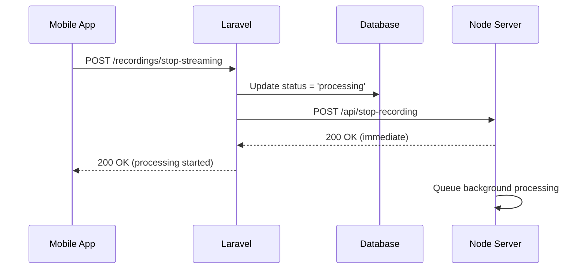
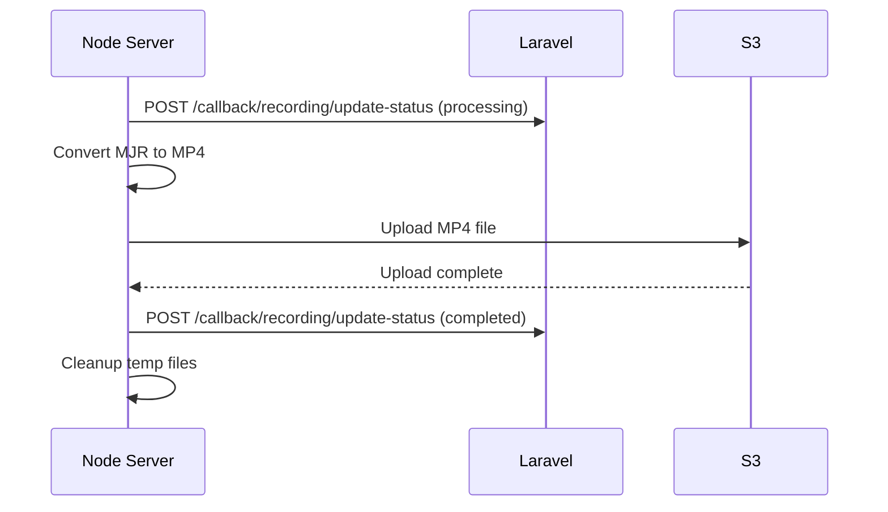

# Async Recording Processing Flow

## Overview

This document describes the asynchronous recording processing flow between the Laravel backend and Node.js processing server. The system is designed to respond immediately to stop-streaming requests while processing recordings in the background.

## Architecture

### Flow Diagram

```
Mobile App → Laravel API → Node Server → Background Processing
                ↓              ↓              ↓
           Quick Response   Queue Job    Update Status
                                             ↓
                                    Laravel Callback API
```

## Components

### 1. Laravel Backend (`camera-app`)

**Location:** `/Applications/XAMPP/xamppfiles/htdocs/Projects/camera-app`

#### Key Files Modified:

1. **RecordingTriggerController.php**
   - `stopStreaming()` - Updates recording status to 'processing' and calls Node server
   - Returns immediate response to mobile app

2. **RecordingController.php**
   - `updateStatus()` - Callback endpoint to receive status updates from Node server
   - Accepts: `processing`, `completed`, `failed` statuses

3. **Recording Model**
   - Status field: `pending`, `processing`, `completed`, `failed`
   - Tracks S3 upload details and processing metadata

4. **routes/api.php**
   - Added callback route: `POST /v1/callback/recording/update-status`
   - Protected with `api.token` middleware

5. **config/services.php**
   - Added `node_server.url` configuration

6. **.env**
   - Added `NODE_SERVER_URL=https://unnifyy.com/node-api`

### 2. Node.js Processing Server (`camera_node_server`)

**Location:** `/Applications/XAMPP/xamppfiles/htdocs/Projects/camera_node_server`

#### Key Files Modified:

1. **apiServer.js**
   - `POST /api/stop-recording` - Returns immediately, processes in background
   - No longer waits for processing to complete

2. **apiNotifier.js**
   - `updateRecordingStatus()` - New method to send status updates to Laravel
   - Calls Laravel callback endpoint at each stage

3. **watcher.js**
   - `processRecording()` - Updated to send status updates:
     - Start: `processing`
     - Success: `completed` (with S3 details)
     - Failure: `failed` (with error message)

#### Configuration (.env):
```bash
LARAVEL_API_URL=https://unnifyy.com/api/v1
LARAVEL_API_TOKEN=your_api_token_here
```

## Processing Flow

### 1. Stop Recording Request



**Request:**
```json
{
  "camera_id": 23,
  "recording_name": "23_Publisher_2025-10-06T23-37-38"
}
```

**Response (Immediate):**
```json
{
  "success": true,
  "message": "Recording stopped successfully. Processing in background.",
  "recording_id": 22,
  "status": "processing",
  "node_response": {
    "success": true,
    "message": "Recording stop acknowledged. Processing has been queued.",
    "data": {
      "camera_id": 23,
      "recording_name": "23_Publisher_2025-10-06T23-37-38",
      "status": "processing",
      "timestamp": "2025-10-06T18:00:00.000Z"
    }
  }
}
```

### 2. Background Processing with Status Updates



**Status Update - Processing:**
```json
{
  "recording_name": "23_Publisher_2025-10-06T23-37-38",
  "status": "processing"
}
```

**Status Update - Completed:**
```json
{
  "recording_name": "23_Publisher_2025-10-06T23-37-38",
  "status": "completed",
  "s3_path": "janus-recordings/23_Publisher_2025-10-06T23-37-38.mp4",
  "s3_bucket": "webrtc.peopletime",
  "file_size": 15728640,
  "format": "mp4",
  "metadata": {
    "s3_url": "https://webrtc.peopletime.s3.us-east-1.amazonaws.com/janus-recordings/23_Publisher_2025-10-06T23-37-38.mp4",
    "processed_at": "2025-10-06T18:05:00.000Z"
  }
}
```

**Status Update - Failed:**
```json
{
  "recording_name": "23_Publisher_2025-10-06T23-37-38",
  "status": "failed",
  "error_message": "Conversion failed: janus-pp-rec error"
}
```

### 3. Database Schema

**recordings table:**
```sql
- id (bigint)
- camera_id (bigint)
- recording_name (varchar)
- recording_timestamp (timestamp)
- file_path (varchar, nullable)
- s3_path (varchar, nullable)
- s3_bucket (varchar, nullable)
- file_size (bigint, nullable)
- duration (int, nullable)
- format (varchar, nullable)
- status (varchar, default='pending') -- pending, processing, completed, failed
- metadata (json, nullable)
- processed_at (timestamp, nullable)
- created_at (timestamp)
- updated_at (timestamp)
```

## API Endpoints

### Laravel API

#### 1. Start Streaming
```
POST /api/v1/recordings/start-streaming
Authorization: Bearer {token}

Request:
{
  "camera_id": 23,
  "recording_name": "23_Publisher_2025-10-06T23-37-38"
}
```

#### 2. Stop Streaming
```
POST /api/v1/recordings/stop-streaming
Authorization: Bearer {token}

Request:
{
  "camera_id": 23,
  "recording_name": "23_Publisher_2025-10-06T23-37-38"
}
```

#### 3. Update Recording Status (Callback)
```
POST /api/v1/callback/recording/update-status
Authorization: Bearer {api_token}

Request:
{
  "recording_name": "23_Publisher_2025-10-06T23-37-38",
  "status": "completed",
  "s3_path": "...",
  "s3_bucket": "...",
  "file_size": 15728640,
  "format": "mp4",
  "metadata": {...}
}
```

### Node.js API

#### 1. Stop Recording
```
POST /api/stop-recording

Request:
{
  "camera_id": 23,
  "recording_name": "23_Publisher_2025-10-06T23-37-38"
}

Response: Immediate (does not wait for processing)
{
  "success": true,
  "message": "Recording stop acknowledged. Processing has been queued.",
  "data": {
    "camera_id": 23,
    "recording_name": "23_Publisher_2025-10-06T23-37-38",
    "status": "processing",
    "timestamp": "2025-10-06T18:00:00.000Z"
  }
}
```

## Configuration

### Laravel `.env`
```bash
NODE_SERVER_URL=https://unnifyy.com/node-api
```

### Laravel `config/services.php`
```php
'node_server' => [
    'url' => env('NODE_SERVER_URL', 'http://localhost:3000'),
],
```

### Node Server `.env`
```bash
API_PORT=3000
LARAVEL_API_URL=https://unnifyy.com/api/v1
LARAVEL_API_TOKEN=your_api_token_here
```

## Deployment Steps

### On Server:

1. **Update Laravel:**
```bash
cd /var/www/web_admin
sudo git pull
php artisan config:clear
php artisan cache:clear
php artisan config:cache
```

2. **Update Node Server:**
```bash
cd /path/to/camera_node_server
git pull
pm2 restart all  # or your process manager command
```

3. **Verify Configuration:**
- Check Laravel `.env` has `NODE_SERVER_URL`
- Check Node `.env` has `LARAVEL_API_URL` and `LARAVEL_API_TOKEN`
- Ensure API token matches between systems

## Error Handling

### Laravel Side:
- If Node server is unreachable, recording status is set to `failed`
- Error logged with details for debugging

### Node Side:
- If conversion fails, status update sent with error message
- If S3 upload fails, status update sent with error message
- If Laravel callback fails, error logged but processing continues

## Benefits

1. **Immediate Response:** Mobile app receives instant confirmation
2. **Better UX:** No timeout issues from long-running processes
3. **Status Tracking:** Real-time status updates in database
4. **Scalability:** Background processing doesn't block API requests
5. **Error Recovery:** Failed recordings properly tracked with error details
6. **Monitoring:** Easy to query recordings by status for monitoring

## Monitoring Queries

```sql
-- Get all processing recordings
SELECT * FROM recordings WHERE status = 'processing';

-- Get failed recordings
SELECT * FROM recordings WHERE status = 'failed';

-- Get completed recordings with S3 details
SELECT * FROM recordings WHERE status = 'completed' AND s3_path IS NOT NULL;

-- Get stuck recordings (processing for > 10 minutes)
SELECT * FROM recordings
WHERE status = 'processing'
AND updated_at < NOW() - INTERVAL 10 MINUTE;
```

## Testing

### Test Stop Streaming:
```bash
curl -X POST https://unnifyy.com/api/v1/recordings/stop-streaming \
  -H "Authorization: Bearer YOUR_TOKEN" \
  -H "Content-Type: application/json" \
  -d '{"camera_id": 23, "recording_name": "23_Publisher_2025-10-06T23-37-38"}'
```

### Check Recording Status:
```bash
curl https://unnifyy.com/api/v1/recordings/23 \
  -H "Authorization: Bearer YOUR_TOKEN"
```
